# Portfolio Architecture Overview

## System Architecture Diagram

```mermaid
graph TB
    subgraph "Frontend & UI Layer"
        WEB["Web Applications"]
        WEB --> CV["MY_CV"]
        WEB --> FB["FbClone"]
        WEB --> WEBPAGE["WebPage"]
        WEB --> ASSIGN["10Assignments"]
        WEB --> FLIGHT["flight-weather-tracker"]
        WEB --> HACK["HackingMonitor"]
    end

    subgraph "Interactive Applications"
        INTERACTIVE["Interactive Tools"]
        INTERACTIVE --> CALC["Calculator/BMI-Calculator"]
        INTERACTIVE --> CLOCK["Clock"]
        INTERACTIVE --> DICE["DiceGame"]
        INTERACTIVE --> TODO["SimpleToDo"]
        INTERACTIVE --> LICENSE["SimpleDrivingLicenseCheck"]
        INTERACTIVE --> QUIZ["QUIZZZZ"]
        INTERACTIVE --> ONCLICK["OnClickEvent"]
        INTERACTIVE --> DUI["DUI"]
        INTERACTIVE --> TIMETABLE["Timetable"]
        INTERACTIVE --> CALCAPP["CalcultorApp"]
    end

    subgraph "Desktop Applications"
        DESKTOP["Desktop Tools"]
        DESKTOP --> CODECHECK["CodeCheck - Code Quality Analyzer"]
        DESKTOP --> SPECTEST["SpecTest - System Specifications"]
        DESKTOP --> ENHANCER["The-Media-Enhancer - Image/Video Upscaling"]
    end

    subgraph "Data Science & AI"
        DATASCIENCE["Machine Learning Projects"]
        DATASCIENCE --> SPAM["SpamTextClassifier"]
        DATASCIENCE --> SPAMDETECT["spam_detetction"]
    end

    subgraph "Utility & Monitoring"
        UTILITY["Utility Tools"]
        UTILITY --> SPEEDTEST["Internet-Speed-Test"]
        UTILITY --> 3DAPP["3D_AppImage"]
        UTILITY --> ASCII["ascii-Art/ascii_art"]
        UTILITY --> INSTA["instamonitor"]
    end

    subgraph "Profile & Config"
        PROFILE["GitHub Profile"]
        PROFILE --> OSAMA["Osama01Anwar"]
        PROFILE --> ARCH["Architecturee"]
    end

    WEB --> SHARED["Shared Technologies: HTML, CSS, JavaScript"]
    DESKTOP --> SHARED
    INTERACTIVE --> SHARED
    DATASCIENCE --> PYTHON["Python, ML Libraries"]
    UTILITY --> PYTHON
    UTIL2["Dependencies: OpenCV, Tkinter, BeautifulSoup"]

    style WEB fill:#e1f5ff
    style INTERACTIVE fill:#f3e5f5
    style DESKTOP fill:#fff3e0
    style DATASCIENCE fill:#e8f5e9
    style UTILITY fill:#fce4ec
    style PROFILE fill:#f1f8e9
    style SHARED fill:#eeeeee
    style PYTHON fill:#eeeeee
    style UTIL2 fill:#eeeeee
```

## Project Categories

### 🌐 Frontend & Web Applications
- **MY_CV** - Portfolio/Resume website
- **FbClone** - Facebook clone UI
- **WebPage** - Web development projects
- **10Assignments** - Assignment submission platform
- **flight-weather-tracker** - CLI-style weather & flight monitoring
- **HackingMonitor** - Security monitoring dashboard

### 🖥️ Interactive Tools & Games
- **Calculator** / **BMI-Calculator** - Calculation utilities
- **Clock** - Time display application
- **DiceGame** - Interactive game
- **SimpleToDo** - Task management
- **SimpleDrivingLicenseCheck** - License validator
- **QUIZZZZ** - Quiz application
- **Timetable** - Schedule organizer
- **CalcultorApp** - Enhanced calculator app

### 💻 Desktop Applications
- **CodeCheck** - Python desktop app for code quality analysis
- **SpecTest** - System specifications checker
- **The-Media-Enhancer** - 4x image/video upscaling tool

### 🤖 Data Science & Machine Learning
- **SpamTextClassifier** - ML-based spam detection
- **spam_detetction** - Spam filtering system

### 🛠️ Utilities & Monitoring
- **Internet-Speed-Test** - Network speed checker
- **3D_AppImage** - 3D image processing
- **ascii-Art** / **ascii_art** - ASCII art generation
- **instamonitor** - Instagram monitoring tool

### 📦 Configuration & Profile
- **Osama01Anwar** - GitHub profile configuration
- **Architecturee** - Architecture documentation

## Technology Stack

### Frontend
- HTML5, CSS3, JavaScript

### Backend & Desktop
- Python (Flask, Tkinter, OpenCV)

### Data Science
- Machine Learning libraries (scikit-learn, TensorFlow, etc.)

### Monitoring & Analytics
- Real-time tracking systems
- Web scraping tools

## Key Features Across Projects

| Feature | Projects |
|---------|----------|
| **Web Development** | 6+ projects |
| **Python Desktop Apps** | 5+ projects |
| **Interactive Games/Tools** | 9+ projects |
| **Data Science/ML** | 2+ projects |
| **System Utilities** | 4+ projects |

---

*Last Updated: 2026-06-08*
*Portfolio contains 30+ active projects across multiple domains*