# 🏗️ Osama Anwar - Portfolio Architecture Overview

## Executive Summary
A comprehensive portfolio containing **30+ projects** spanning multiple domains including web development, desktop applications, machine learning, interactive tools, and system utilities. Built with modern technologies including JavaScript, Python, and data science frameworks.

---

## 🎯 System Architecture Diagram

```mermaid
graph TB
    subgraph "PRESENTATION_LAYER[🌐 Presentation & Frontend Layer]"
        direction TB
        
        subgraph "WEB_APPS[Web Applications]"
            CV["📄 MY_CV<br/>Portfolio Website<br/>HTML/CSS/JS"]
            FB["👥 FbClone<br/>Facebook UI Clone<br/>HTML/CSS"]
            WEBPAGE["🌍 WebPage<br/>General Web Projects<br/>HTML/CSS/JS"]
        end
        
        subgraph "RESPONSIVE[Responsive Web Interfaces]"
            ASSIGN["📋 10Assignments<br/>Assignment Portal<br/>HTML/CSS/JS"]
            FLIGHT["✈️ flight-weather-tracker<br/>CLI-style Monitoring<br/>HTML/Real-time Updates"]
            HACK["🔒 HackingMonitor<br/>Security Dashboard<br/>HTML/CSS/JS"]
        end
    end

    subgraph "INTERACTIVE_LAYER[🎮 Interactive Application Layer]"
        direction TB
        
        subgraph "CALCULATORS[Calculation Tools]"
            CALC["🧮 Calculator<br/>Basic Math Operations<br/>JavaScript DOM"]
            BMI["⚖️ BMI-Calculator<br/>Health Metrics<br/>JavaScript Logic"]
            CALCAPP["🖩 CalcultorApp<br/>Scientific Calculator<br/>Normal & Scientific Modes"]
        end
        
        subgraph "GAMES[Interactive Games]"
            DICE["🎲 DiceGame<br/>Random Dice Roller<br/>CSS Animation"]
            QUIZ["🎯 QUIZZZZ<br/>Quiz Application<br/>Q&A Engine"]
        end
        
        subgraph "PRODUCTIVITY[Productivity Tools]"
            TODO["✅ SimpleToDo<br/>Task Management<br/>HTML/JS Storage"]
            TIMETABLE["📅 Timetable<br/>Schedule Organizer<br/>Calendar UI"]
            LICENSE["🚗 SimpleDrivingLicenseCheck<br/>License Validator<br/>Form Processing"]
        end
        
        subgraph "UTILITIES_UI[Utility UIs]"
            CLOCK["⏰ Clock<br/>Real-time Display<br/>JavaScript Timer"]
            ONCLICK["🖱️ OnClickEvent<br/>Event Handling Demo<br/>DOM Events"]
            DUI["🎨 DUI<br/>UI Component Library<br/>CSS Styling"]
        end
    end

    subgraph "DESKTOP_LAYER[💻 Desktop Application Layer]"
        direction TB
        
        subgraph "PYTHON_GUI[Python GUI Applications]"
            CODECHECK["🔍 CodeCheck<br/>Code Quality Analyzer<br/>Python + Tkinter<br/>Multi-language Support<br/>Real-time Scanning"]
            SPECTEST["🖥️ SpecTest<br/>System Specifications<br/>Python<br/>Hardware Info<br/>System Resources"]
            ENHANCER["🎬 The-Media-Enhancer<br/>Image/Video Upscaling<br/>Python + Tkinter<br/>OpenCV Integration<br/>4x Resolution Boost"]
        end
    end

    subgraph "DATASCIENCE_LAYER[🤖 Data Science & ML Layer]"
        direction TB
        
        subgraph "ML_MODELS[Machine Learning Models]"
            SPAM["📧 SpamTextClassifier<br/>Spam Detection<br/>Python + ML Libraries<br/>Text Classification<br/>NLP Processing"]
            SPAMDETECT["🚫 spam_detetction<br/>Spam Filtering System<br/>Python<br/>Pattern Recognition<br/>Email Analysis"]
        end
    end

    subgraph "UTILITY_LAYER[🛠️ Utility & Monitoring Layer]"
        direction TB
        
        subgraph "SYSTEM_TOOLS[System Tools]"
            SPEEDTEST["📡 Internet-Speed-Test<br/>Network Diagnostics<br/>Python<br/>Speed Measurement<br/>Connection Analysis"]
        end
        
        subgraph "IMAGE_PROC[Image Processing]"
            3DAPP["🎆 3D_AppImage<br/>3D Image Processing<br/>Python<br/>Visual Effects"]
            ASCII["🎨 ascii-Art / ascii_art<br/>ASCII Art Generator<br/>Python<br/>Character-based Art"]
        end
        
        subgraph "MONITORING[Monitoring Tools]"
            INSTA["📸 instamonitor<br/>Instagram Monitoring<br/>Web Scraping<br/>Account Tracking"]
        end
    end

    subgraph "INFRASTRUCTURE[🔧 Infrastructure & Config]"
        direction TB
        
        subgraph "PROFILE[GitHub Profile]"
            OSAMA["👤 Osama01Anwar<br/>Profile Configuration<br/>README Config"]
            ARCH["🏗️ Architecturee<br/>Architecture Documentation<br/>Project Structure"]
        end
    end

    style PRESENTATION_LAYER fill:#e3f2fd,stroke:#1976d2,stroke-width:3px,color:#000
    style WEB_APPS fill:#bbdefb,stroke:#1976d2,stroke-width:2px
    style RESPONSIVE fill:#bbdefb,stroke:#1976d2,stroke-width:2px
    
    style INTERACTIVE_LAYER fill:#f3e5f5,stroke:#7b1fa2,stroke-width:3px,color:#000
    style CALCULATORS fill:#e1bee7,stroke:#7b1fa2,stroke-width:2px
    style GAMES fill:#e1bee7,stroke:#7b1fa2,stroke-width:2px
    style PRODUCTIVITY fill:#e1bee7,stroke:#7b1fa2,stroke-width:2px
    style UTILITIES_UI fill:#e1bee7,stroke:#7b1fa2,stroke-width:2px
    
    style DESKTOP_LAYER fill:#fff3e0,stroke:#e65100,stroke-width:3px,color:#000
    style PYTHON_GUI fill:#ffe0b2,stroke:#e65100,stroke-width:2px
    
    style DATASCIENCE_LAYER fill:#e8f5e9,stroke:#2e7d32,stroke-width:3px,color:#000
    style ML_MODELS fill:#c8e6c9,stroke:#2e7d32,stroke-width:2px
    
    style UTILITY_LAYER fill:#fce4ec,stroke:#c2185b,stroke-width:3px,color:#000
    style SYSTEM_TOOLS fill:#f8bbd0,stroke:#c2185b,stroke-width:2px
    style IMAGE_PROC fill:#f8bbd0,stroke:#c2185b,stroke-width:2px
    style MONITORING fill:#f8bbd0,stroke:#c2185b,stroke-width:2px
    
    style INFRASTRUCTURE fill:#f1f8e9,stroke:#558b2f,stroke-width:3px,color:#000
    style PROFILE fill:#dcedc8,stroke:#558b2f,stroke-width:2px
```



---

## 📊 Detailed Layer Architecture

### Layer 1: 🌐 Presentation & Frontend Layer
The topmost layer responsible for user interaction and visual presentation.

#### Web Applications
| Project | Description | Technologies | Purpose |
|---------|-------------|--------------|---------|
| **MY_CV** | Personal portfolio and resume website | HTML5, CSS3, JavaScript | Professional portfolio showcase |
| **FbClone** | Replica of Facebook's user interface | HTML5, CSS3 (Flexbox/Grid) | Social media UI learning project |
| **WebPage** | General web development projects | HTML5, CSS3, Vanilla JS | Multiple web-based experiments |
| **10Assignments** | Assignment submission and tracking platform | HTML5, CSS3, JavaScript | Academic project management |
| **flight-weather-tracker** | CLI-style real-time flight and weather monitoring | HTML5, CSS3, Real-time JavaScript | Lahore airspace monitoring system |
| **HackingMonitor** | Security and system monitoring dashboard | HTML5, CSS3, JavaScript | Real-time security visualization |

---

### Layer 2: 🎮 Interactive Application Layer
Rich interactive applications with user engagement and state management.

#### Calculation Tools
| Project | Description | Technologies | Features |
|---------|-------------|--------------|----------|
| **Calculator** | Basic mathematical calculator | HTML, CSS, JavaScript | Addition, subtraction, multiplication, division |
| **BMI-Calculator** | Body Mass Index calculator | HTML, CSS, JavaScript DOM | Health metrics, personalized results |
| **CalcultorApp** | Enhanced scientific calculator | JavaScript, Tkinter GUI | Normal & scientific operation modes |

#### Interactive Games
| Project | Description | Technologies | Mechanics |
|---------|-------------|--------------|-----------|
| **DiceGame** | Interactive dice rolling game | HTML, CSS (Animations), JavaScript | Random generation, visual feedback |
| **QUIZZZZ** | Quiz application with scoring | HTML, CSS, JavaScript | Q&A engine, score tracking, feedback |

#### Productivity Tools
| Project | Description | Technologies | Use Case |
|---------|-------------|--------------|----------|
| **SimpleToDo** | Task management application | HTML, CSS, JavaScript (LocalStorage) | Task creation, deletion, persistence |
| **Timetable** | Schedule and calendar organizer | HTML, CSS, JavaScript | Time slot management, scheduling |
| **SimpleDrivingLicenseCheck** | License validation system | HTML, CSS, JavaScript | Form validation, status checking |

#### Utility UI Components
| Project | Description | Technologies | Purpose |
|---------|-------------|--------------|---------|
| **Clock** | Real-time digital clock display | HTML, CSS, JavaScript Timer | Time visualization, automation |
| **OnClickEvent** | DOM event handling demonstration | HTML, CSS, JavaScript Events | Event listener learning |
| **DUI** | User interface component library | HTML, CSS (Styling) | Reusable UI components |

---

### Layer 3: 💻 Desktop Application Layer
Standalone applications with GUI for system-level tasks.

#### Python GUI Applications

##### 🔍 CodeCheck - Code Quality Analyzer
```
Features:
├── Multi-language Support
│   ├── Python
│   ├── JavaScript
│   ├── Java
│   └── C++
├── Real-time Scanning
│   ├── Progress visualization
│   ├── File analysis
│   └── Performance metrics
├── Code Metrics
│   ├── Quality score
│   ├── Grade assignment
│   ├── Issue identification
│   └── Improvement suggestions
└── User Interface
    ├── Tkinter GUI
    ├── File selection
    └── Results display
```

**Tech Stack:** Python, Tkinter, Code Analysis Libraries

---

##### 🖥️ SpecTest - System Specifications
```
Capabilities:
├── Hardware Information
│   ├── CPU specs
│   ├── RAM capacity
│   ├── Storage details
│   └── GPU information
├── System Resources
│   ├── CPU usage
│   ├── Memory usage
│   ├── Disk I/O
│   └── Process monitoring
├── Network Information
│   ├── IP address
│   ├── Connection type
│   └── Bandwidth
└── Display
    ├── Python-based reporting
    ├── Real-time updates
    └── System overview
```

**Tech Stack:** Python, System Libraries, Platform APIs

---

##### 🎬 The-Media-Enhancer - Image/Video Upscaling
```
Architecture:
├── Input Handler
│   ├── Image import
│   ├── Video processing
│   └── Format support
├── Processing Engine
│   ├── OpenCV library
│   ├── AI upscaling model
│   ├── 4x resolution boost
│   └── Quality preservation
├── Output Manager
│   ├── File export
│   ├── Format conversion
│   └── Batch processing
└── GUI (Tkinter)
    ├── Preview window
    ├── Progress tracking
    └── Settings panel
```

**Tech Stack:** Python, Tkinter, OpenCV, Deep Learning

---

### Layer 4: 🤖 Data Science & Machine Learning Layer
Advanced analytics and predictive modeling applications.

#### Machine Learning Projects

##### 📧 SpamTextClassifier - Email Spam Detection
```
Pipeline:
├── Data Preprocessing
│   ├── Text tokenization
│   ├── Normalization
│   ├── Stop word removal
│   └── Feature extraction
├── Feature Engineering
│   ├── TF-IDF vectorization
│   ├── N-gram analysis
│   └── Word embeddings
├── Classification Models
│   ├── Naive Bayes
│   ├── SVM
│   ├── Random Forest
│   └── Neural Networks
├── Model Evaluation
│   ├── Accuracy metrics
│   ├── Precision/Recall
│   ├── F1-score
│   └── Confusion matrix
└── Deployment
    ├── Model serialization
    ├── Inference pipeline
    └── API integration
```

**Tech Stack:** Python, scikit-learn, NLTK, TensorFlow, Pandas

---

##### 🚫 spam_detetction - Spam Filtering System
```
Components:
├── Input Analysis
│   ├── Message parsing
│   ├── Header analysis
│   └── Content extraction
├── Detection Methods
│   ├── Keyword matching
│   ├── Pattern recognition
│   ├── Heuristic analysis
│   └── Machine learning
├── Filtering Rules
│   ├── Blacklist checking
│   ├── Whitelist checking
│   ├── Sender verification
│   └── Content scanning
└── Output Management
    ├── Classification
    ├── Confidence scoring
    └── Action determination
```

**Tech Stack:** Python, Machine Learning Libraries, Email Processing

---

### Layer 5: 🛠️ Utility & Monitoring Layer
System utilities and monitoring tools for diagnostics and tracking.

#### System Tools

##### 📡 Internet-Speed-Test
```
Functionality:
├── Network Testing
│   ├── Download speed
│   ├── Upload speed
│   ├── Latency/Ping
│   └── Jitter measurement
├── Server Selection
│   ├── Nearest server detection
│   ├── Multiple test servers
│   └── Geographic optimization
├── Data Analysis
│   ├── Speed history
│   ├── Trend analysis
│   ├── Performance graphs
│   └── Statistics
└── Reporting
    ├── Speed results
    ├── Connection quality
    ├── ISP information
    └── Comparison metrics
```

**Tech Stack:** Python, Network Libraries, Data Visualization

---

#### Image Processing

##### 🎆 3D_AppImage - 3D Image Processing
**Purpose:** Advanced 3D visual effects and transformations
**Tech Stack:** Python, PIL/OpenCV, 3D Libraries

##### 🎨 ascii-Art / ascii_art - ASCII Art Generator
```
Features:
├── Input Processing
│   ├── Image import
│   ├── Format conversion
│   └── Resolution adjustment
├── Conversion Engine
│   ├── Grayscale conversion
│   ├── Character mapping
│   ├── Density analysis
│   └── Detail preservation
├── Output Options
│   ├── Console display
│   ├── File export
│   ├── Color support
│   └── Custom character sets
└── Customization
    ├── Character selection
    ├── Contrast adjustment
    └── Size scaling
```

**Tech Stack:** Python, PIL/OpenCV, ASCII Libraries

---

#### Monitoring Tools

##### 📸 instamonitor - Instagram Monitoring
```
Capabilities:
├── Account Tracking
│   ├── Profile analysis
│   ├── Follower tracking
│   ├── Post monitoring
│   └── Engagement metrics
├── Data Collection
│   ├── Web scraping
│   ├── API integration
│   ├── Real-time updates
│   └── Historical data
├── Analytics
│   ├── Growth trends
│   ├── Engagement analysis
│   ├── Content performance
│   └── Audience insights
└── Reporting
    ├── Dashboard display
    ├── Statistics export
    ├── Visualization
    └── Trend analysis
```

**Tech Stack:** Python, Web Scraping (BeautifulSoup/Selenium), Instagram API

---

### Layer 6: 🔧 Infrastructure & Configuration Layer
Documentation, configuration, and profile management.

| Project | Purpose | Type | Content |
|---------|---------|------|---------|
| **Osama01Anwar** | GitHub profile configuration | Config Files | Profile README, badges, links |
| **Architecturee** | Architecture documentation | Documentation | System design docs, guides |

---

## 🛠️ Technology Stack Overview

### Frontend Technologies
```
HTML5
├── Semantic markup
├── Form elements
└── Canvas & SVG

CSS3
├── Flexbox layouts
├── CSS Grid
├── Animations
├── Responsive design
└── Media queries

JavaScript (Vanilla)
├── DOM manipulation
├── Event handling
├── Asynchronous operations
├── LocalStorage API
├── Fetch API
└── ES6+ features
```

### Backend & Desktop Technologies
```
Python 3
├── Core Language Features
│   ├── OOP Programming
│   ├── Functional programming
│   ├── Decorators & context managers
│   └── Async/await
│
├── GUI Frameworks
│   ├── Tkinter (standard library)
│   ├── Window management
│   ├── Widget creation
│   └── Event handling
│
├── Data Processing
│   ├── Pandas (DataFrames)
│   ├── NumPy (Numerical computing)
│   ├── CSV/JSON handling
│   └── Data manipulation
│
├── Computer Vision
│   ├── OpenCV (image processing)
│   ├── PIL/Pillow (image operations)
│   ├── Image transformation
│   └── Video processing
│
├── Machine Learning
│   ├── scikit-learn (classical ML)
│   ├── TensorFlow (deep learning)
│   ├── Keras (neural networks)
│   └── NLTK (NLP)
│
├── System Utilities
│   ├── OS & platform modules
│   ├── System information
│   ├── Process management
│   └── Network utilities
│
└── Web Technologies
    ├── BeautifulSoup (web scraping)
    ├── Selenium (browser automation)
    ├── Requests library
    └── API integration
```

### Libraries & Dependencies

#### Web Development
```
- HTML5 Semantic Elements
- CSS3 Features (Grid, Flexbox, Animations)
- JavaScript ES6+
- DOM APIs
- LocalStorage
- Fetch API
```

#### Desktop Application Development
```
- Tkinter (GUI framework)
- OpenCV (cv2) - Computer Vision
- PIL/Pillow - Image Processing
- Tkinter.messagebox - Dialogs
- Threading - Parallel execution
```

#### Data Science & ML
```
- scikit-learn (ML algorithms)
- TensorFlow/Keras (Deep Learning)
- NLTK (Natural Language Processing)
- Pandas (Data manipulation)
- NumPy (Numerical operations)
- Matplotlib/Seaborn (Visualization)
```

#### System & Network
```
- speedtest library
- requests library
- BeautifulSoup4
- Selenium WebDriver
- psutil (system info)
- socket (networking)
```

---

## 📈 Project Statistics

### Distribution by Category
```
Web Applications:        6 projects  (20%)
Interactive Tools:       9 projects  (30%)
Desktop Applications:    3 projects  (10%)
Machine Learning:        2 projects  (7%)
Utilities:               4 projects  (13%)
Profile/Config:          2 projects  (7%)
Other:                   4 projects  (13%)
────────────────────────────────────
TOTAL:                  30 projects (100%)
```

### Technology Breakdown
```
JavaScript:             15 projects  (50%)
Python:                 14 projects  (47%)
Other:                   1 project   (3%)
```

### Complexity Levels
```
🟢 Simple (UI/Display):      10 projects
🟡 Intermediate (Logic):     14 projects
🔴 Advanced (ML/Processing):  6 projects
```

---

## 🔄 Data Flow Architecture

### Web Application Flow
```
User Input
    ↓
HTML Form/Event
    ↓
JavaScript Handler
    ↓
DOM Manipulation
    ↓
Visual Update
    ↓
LocalStorage (optional)
```

### Desktop Application Flow
```
User Input (GUI)
    ↓
Tkinter Event Handler
    ↓
Business Logic (Python)
    ↓
Data Processing
    ↓
File I/O / System Call
    ↓
GUI Update
    ↓
Display Results
```

### Machine Learning Flow
```
Input Data
    ↓
Preprocessing
    ↓
Feature Engineering
    ↓
Model Training
    ↓
Validation
    ↓
Inference/Prediction
    ↓
Output Results
```

---

## 🎯 Key Features & Capabilities

### Frontend Capabilities
- ✅ Responsive web design
- ✅ Interactive user interfaces
- ✅ Real-time updates
- ✅ Form validation
- ✅ Client-side storage
- ✅ Event handling
- ✅ DOM manipulation
- ✅ CSS animations

### Backend Capabilities
- ✅ File I/O operations
- ✅ System resource access
- ✅ Image/video processing
- ✅ Network operations
- ✅ Data analysis
- ✅ Machine learning inference
- ✅ Multi-threading
- ✅ GUI applications

### Data Science Capabilities
- ✅ Text classification
- ✅ Pattern recognition
- ✅ Spam detection
- ✅ Feature extraction
- ✅ Model training
- ✅ Predictive analytics
- ✅ Data visualization
- ✅ Performance metrics

---

## 🚀 Deployment Architecture

### Web Projects
```
Source Code (GitHub)
    ↓
Version Control
    ↓
Browser Rendering
    ↓
Client-side Execution
    ↓
User Display
```

### Desktop Applications
```
Source Code (GitHub)
    ↓
Python Interpreter
    ↓
Tkinter Window
    ↓
System Resources
    ↓
File Output
```

### ML Models
```
Training Data
    ↓
Model Development
    ↓
Model Serialization
    ↓
Inference Pipeline
    ↓
Predictions
```

---

## 📊 Integration Points

### Cross-Project Technologies
```
JavaScript ←→ Web Applications ←→ HTML/CSS
     ↓
   LocalStorage
     ↓
   State Management

Python ←→ Desktop Apps ←→ Tkinter
  ↓           ↓              ↓
 ML   File I/O   System APIs
  ↓           ↓
 Models   Database (Optional)
```

---

## 🔐 Security & Performance Considerations

### Frontend Security
- Input validation
- XSS prevention
- CSRF protection
- Secure data storage

### Backend Security
- Input sanitization
- Secure file handling
- Resource limitation
- Error handling

### ML Security
- Model integrity
- Data privacy
- Adversarial robustness

---

## 📝 Documentation & Naming Conventions

### Project Structure
```
project-name/
├── README.md           # Project documentation
├── index.html          # Web entry point
├── main.py             # Python entry point
├── src/                # Source directory
├── assets/             # Images, fonts, etc.
├── styles/             # CSS files
└── scripts/            # JavaScript files
```

### Naming Conventions
- **Web Projects:** Descriptive names (MY_CV, FbClone)
- **Tools:** Function-based names (Calculator, Timetable)
- **ML Projects:** Domain-specific names (SpamTextClassifier)
- **Utilities:** Purpose-driven names (Internet-Speed-Test)

---

## 🎓 Learning Path & Progression

### Phase 1: Fundamentals (Beginner)
- Calculator, Clock, DiceGame
- SimpleToDo, SimpleDrivingLicenseCheck
- Basic HTML/CSS/JavaScript

### Phase 2: Intermediate (Intermediate)
- FbClone, BMI-Calculator
- Interactive games and tools
- Advanced JavaScript concepts

### Phase 3: Advanced (Intermediate-Advanced)
- Desktop applications (CodeCheck, SpecTest)
- Image processing (The-Media-Enhancer)
- System utilities

### Phase 4: Expert (Advanced)
- Machine learning projects
- Data science applications
- Advanced Python programming

---

## 🔮 Future Enhancement Opportunities

### Web Applications
- [ ] Backend API integration
- [ ] Database connectivity
- [ ] User authentication
- [ ] Cloud deployment

### Desktop Applications
- [ ] Cross-platform packaging
- [ ] Performance optimization
- [ ] Advanced GUI features
- [ ] Automated testing

### Machine Learning
- [ ] Model improvement
- [ ] New datasets
- [ ] API endpoints
- [ ] Real-time predictions

### General
- [ ] Unit testing
- [ ] Documentation expansion
- [ ] CI/CD pipeline
- [ ] Performance benchmarking

---

## 📞 Project Summary Table

| # | Project | Type | Language | Complexity | Status |
|---|---------|------|----------|------------|--------|
| 1 | MY_CV | Web | HTML/CSS/JS | 🟢 Simple | ✅ Complete |
| 2 | FbClone | Web | HTML/CSS | 🟡 Intermediate | ✅ Complete |
| 3 | WebPage | Web | HTML/CSS/JS | 🟢 Simple | ✅ Complete |
| 4 | 10Assignments | Web | HTML/CSS/JS | 🟡 Intermediate | ✅ Complete |
| 5 | flight-weather-tracker | Web | HTML/CSS/JS | 🟡 Intermediate | ✅ Complete |
| 6 | HackingMonitor | Web | HTML/CSS/JS | 🟡 Intermediate | ✅ Complete |
| 7 | Calculator | Interactive | JS | 🟢 Simple | ✅ Complete |
| 8 | BMI-Calculator | Interactive | JS | 🟢 Simple | ✅ Complete |
| 9 | CalcultorApp | Desktop | Python | 🟡 Intermediate | ✅ Complete |
| 10 | Clock | Interactive | JS | 🟢 Simple | ✅ Complete |
| 11 | DiceGame | Interactive | HTML/CSS/JS | 🟢 Simple | ✅ Complete |
| 12 | QUIZZZZ | Interactive | JS | 🟡 Intermediate | ✅ Complete |
| 13 | SimpleToDo | Interactive | HTML/CSS/JS | 🟡 Intermediate | ✅ Complete |
| 14 | Timetable | Interactive | HTML/CSS/JS | 🟡 Intermediate | ✅ Complete |
| 15 | SimpleDrivingLicenseCheck | Interactive | JS | 🟢 Simple | ✅ Complete |
| 16 | OnClickEvent | Interactive | JS | 🟢 Simple | ✅ Complete |
| 17 | DUI | Interactive | HTML/CSS | 🟡 Intermediate | ✅ Complete |
| 18 | CodeCheck | Desktop | Python | 🔴 Advanced | ✅ Complete |
| 19 | SpecTest | Desktop | Python | 🟡 Intermediate | ✅ Complete |
| 20 | The-Media-Enhancer | Desktop | Python | 🔴 Advanced | ✅ Complete |
| 21 | SpamTextClassifier | ML | Python | 🔴 Advanced | ✅ Complete |
| 22 | spam_detetction | ML | Python | 🔴 Advanced | ✅ Complete |
| 23 | Internet-Speed-Test | Utility | Python | 🟡 Intermediate | ✅ Complete |
| 24 | 3D_AppImage | Utility | Python | 🟡 Intermediate | ✅ Complete |
| 25 | ascii-Art | Utility | Python | 🟡 Intermediate | ✅ Complete |
| 26 | ascii_art | Utility | Python | 🟡 Intermediate | ✅ Complete |
| 27 | instamonitor | Utility | Python | 🟡 Intermediate | ✅ Complete |
| 28 | Osama01Anwar | Config | Markdown | 🟢 Simple | ✅ Complete |
| 29 | Architecturee | Documentation | HTML | 🟡 Intermediate | ✅ Complete |
| 30 | Architecture | Documentation | Markdown | 🟢 Simple | ✅ Complete |

---

## 🏆 Notable Projects Highlight

### 🔍 CodeCheck - Code Quality Analyzer
**Most Advanced Project**
- Real-time code scanning across multiple languages
- AI-powered analysis with scoring and grading
- Actionable improvement suggestions
- Production-ready GUI application

### 🎬 The-Media-Enhancer - Media Upscaling
**Most Complex Technology Stack**
- Deep learning integration
- OpenCV computer vision
- 4x resolution enhancement
- Batch processing capabilities

### 🤖 SpamTextClassifier
**Most Data Science-Heavy**
- NLP pipeline implementation
- Multiple ML algorithm comparison
- Feature engineering and extraction
- Real-world application

---

## 📋 Architecture Summary

**Total Projects:** 30+  
**Primary Languages:** JavaScript (50%), Python (47%)  
**Layers:** 6 (Presentation, Interactive, Desktop, ML, Utility, Infrastructure)  
**Technology Domains:** Web, Desktop, ML, Data Science  
**Deployment Models:** Client-side, Desktop, CLI  

---

*Last Updated: June 8, 2026*  
*Portfolio Version: 1.0*  
*Total Documentation: Comprehensive*